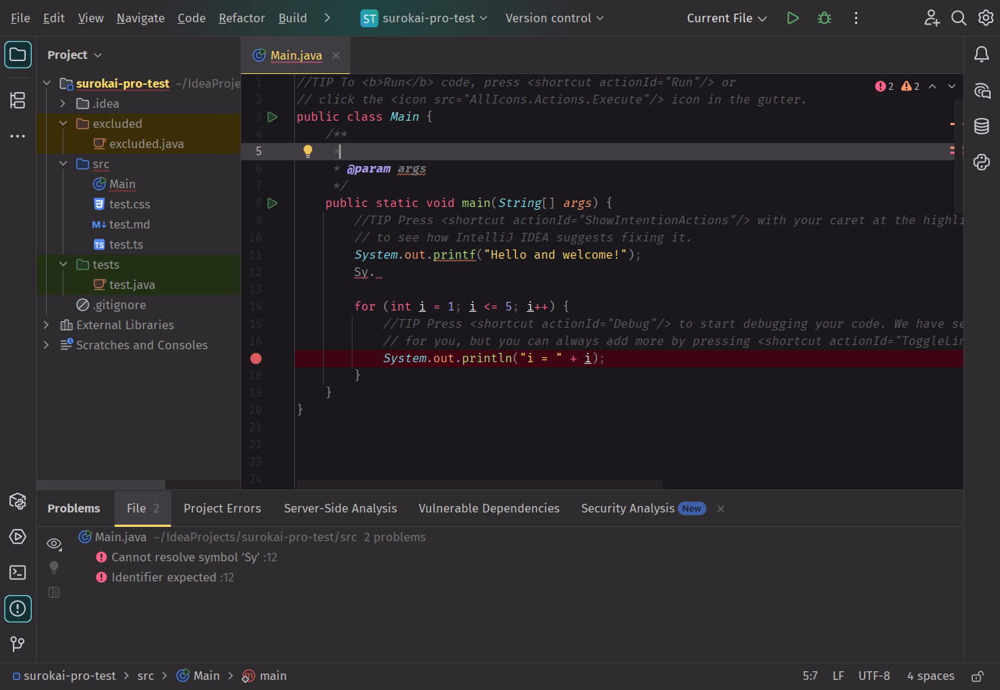
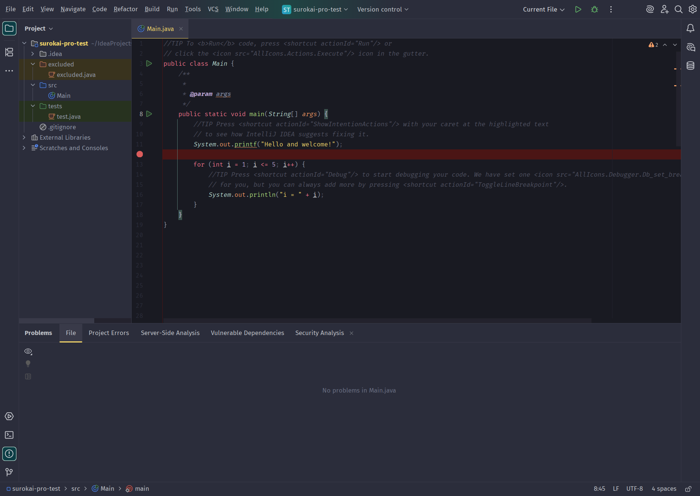
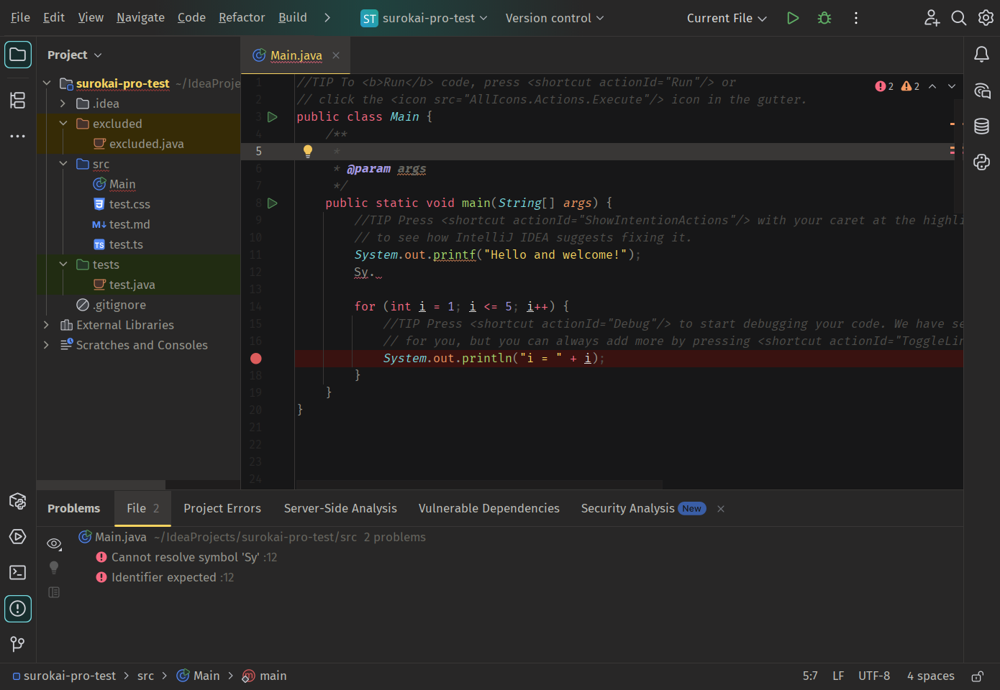
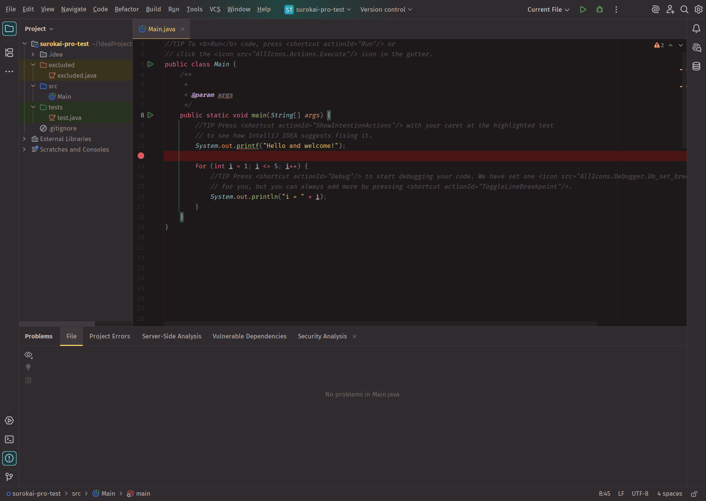
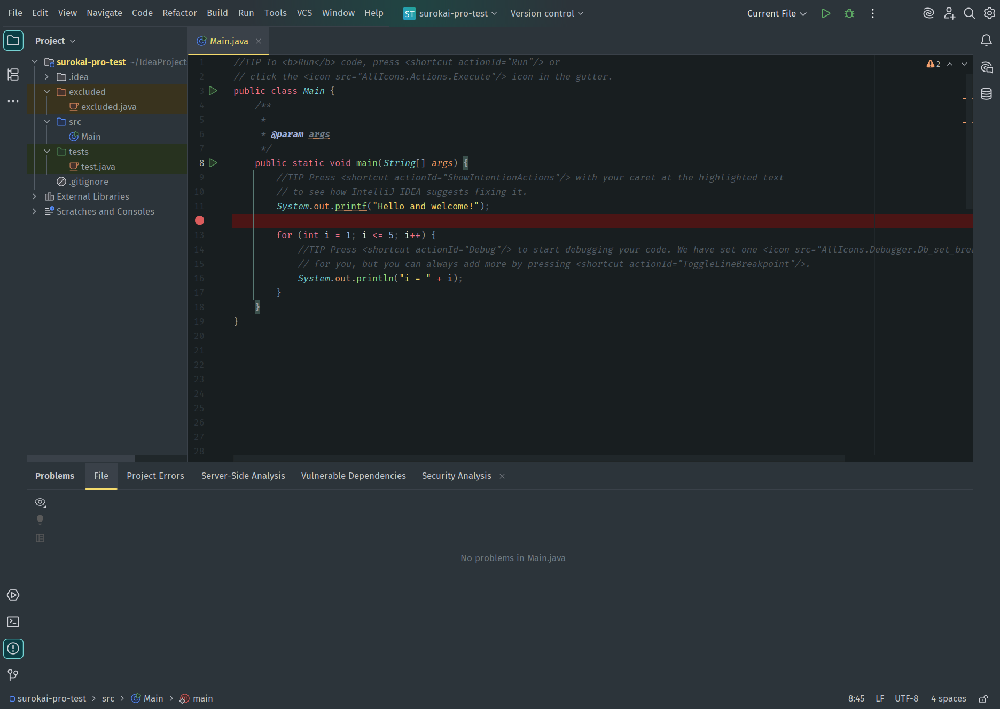
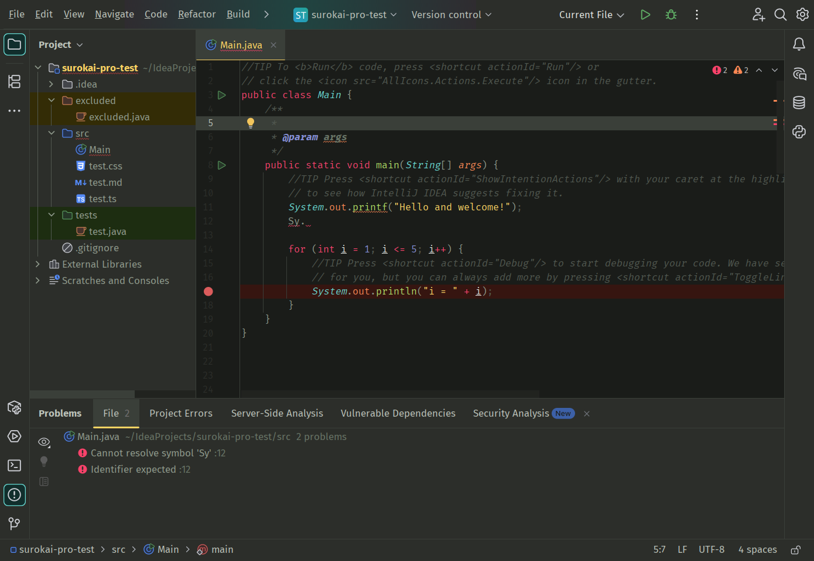

# Surokai Pro for JetBrains

An unofficial Monokai-Pro-like theme, initially adapted by [Subtheme](https://subtheme.dev) and now maintained
by [kawazoe](https://github.com/kawazoe/surokai-pro). This repository includes the default theme, classic theme, and
four filters: Machine, Octagon, Ristretto, and Spectrum.

Credit goes to the original creator: [https://monokai.pro](https://monokai.pro).

Download the latest build from [Releases](https://github.com/kawazoe/surokai-pro/releases).

## Building the theme

You can run these instructions from any terminal, or straight from the IntelliJ integrated terminal as long as you have
the Plugin DevKit installed.

First, setup a python environment:

```
$ python3 -m venv main
$ source ./main/bin/activate
```

Then install dependencies:

```
$ pip install -r ./requirements.txt
```

Finally, run the build script to generate the plugin's files. Make sure it have executable permissions first.

```
$ ./compile.py
```

From there, you can make edits to the project, and run the build script again to update the plugin. You can use the
provided run configuration to test your changes and recompile template changes.

When you're ready to generate the final plugin package, right click on the module in the project view and select:
"Prepare Plugin Module For Deployment". The plugin jar file will be exported to the `out` directory.

## Screenshots

### Surokai Pro:



### Grade Deep:



### Grade Weathered:



### Grade Rustic:



### Grade Matrix:



### Grade Classic:


