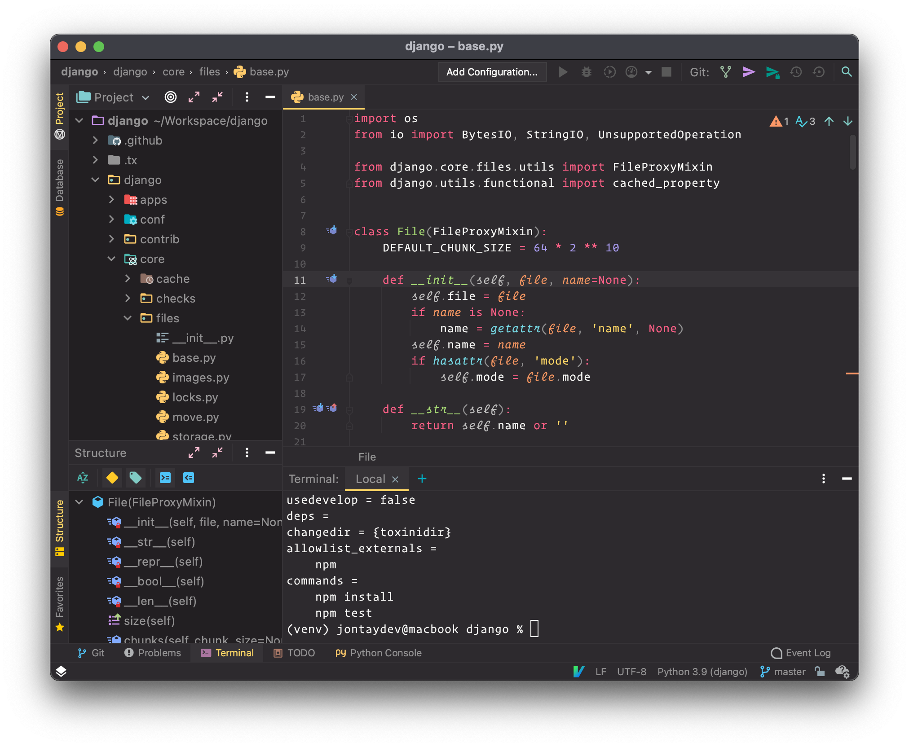
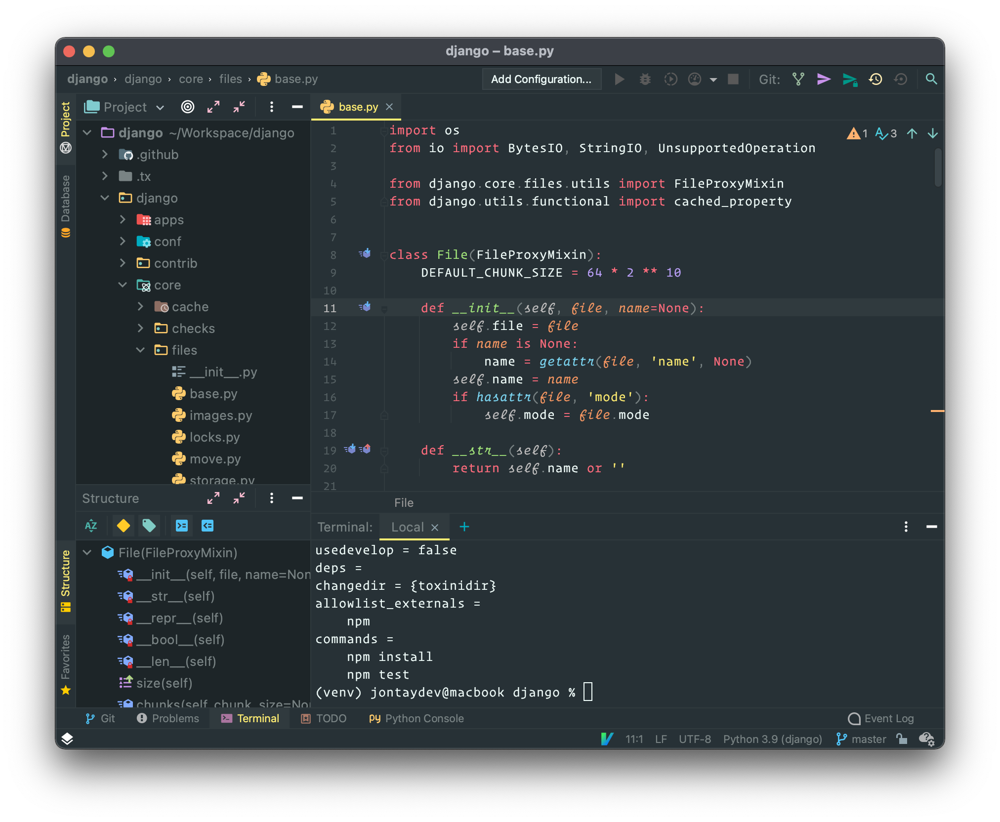
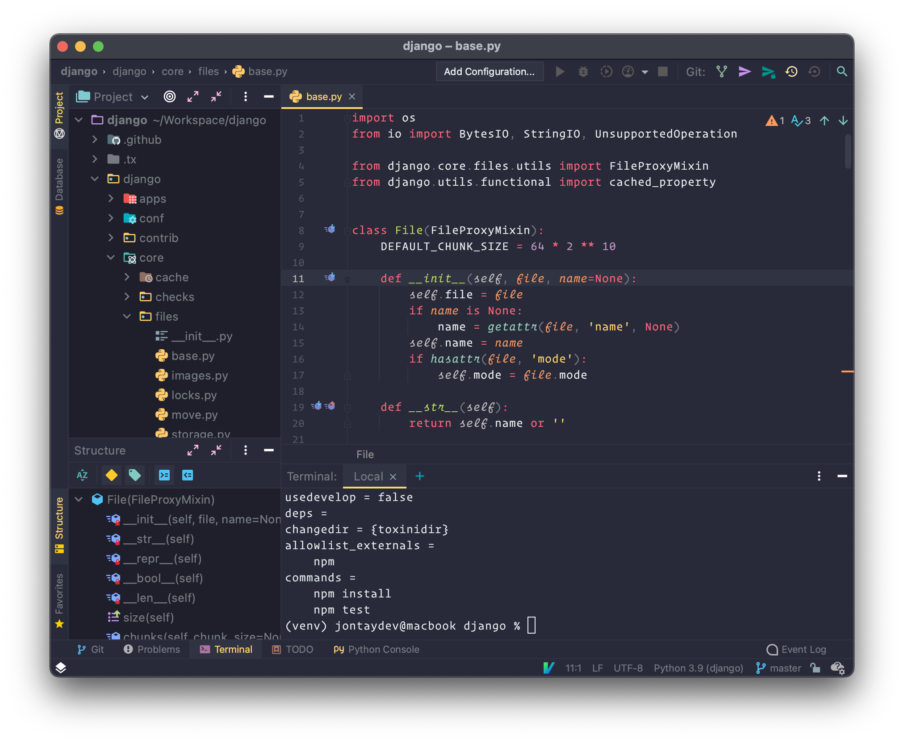
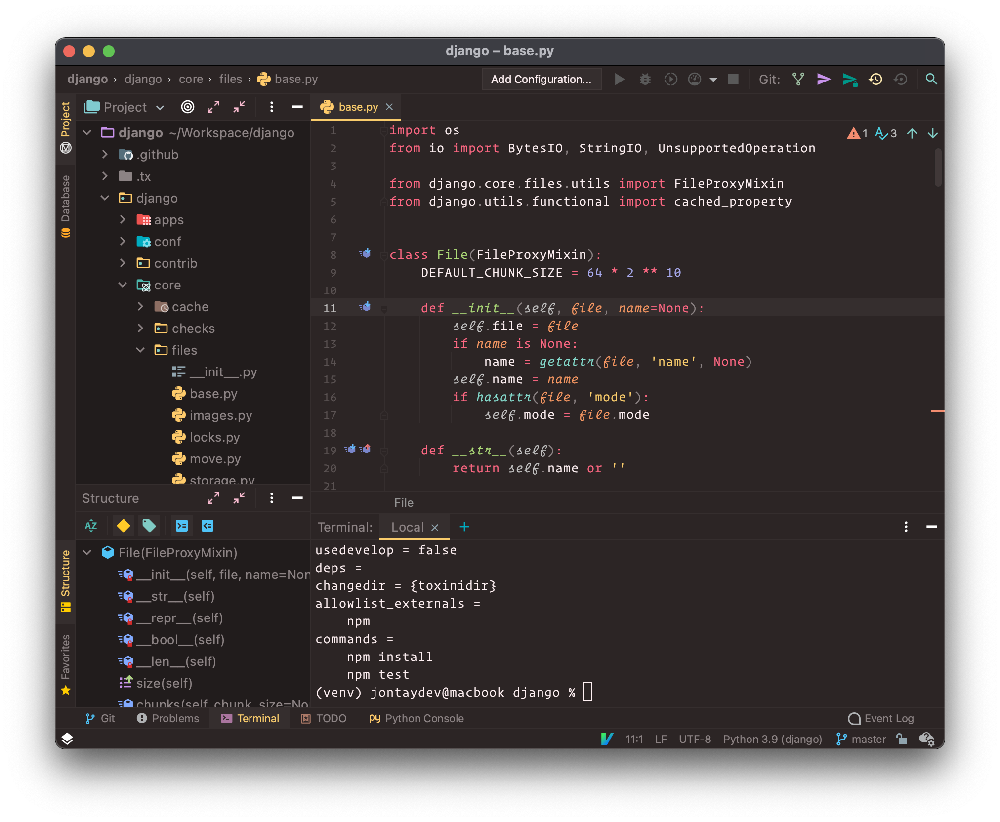
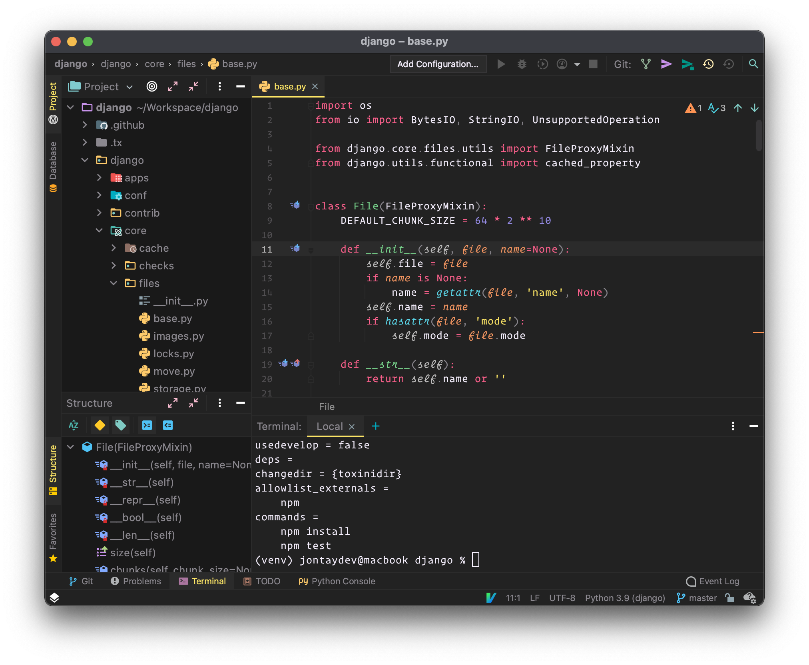

# Surokai Pro for JetBrains

# Download: https://plugins.jetbrains.com/plugin/13643-monokai-pro-theme

## Build

To build the plugin for IntelliJ, follow these steps:

1. Build this project with sublate From the project root: `sublate`.
2. Open the `build` directory with IntelliJ.
3. From the menubar, select Build -> Prepare Plugin Module For Deployment.
4. The plugin jar file will be exported to the `build` directory.

## Screenshots

### Surokai Pro:

### Filter Machine:

### Filter Octagon:

### Filter Ristretto:

### Filter Spectrum:

